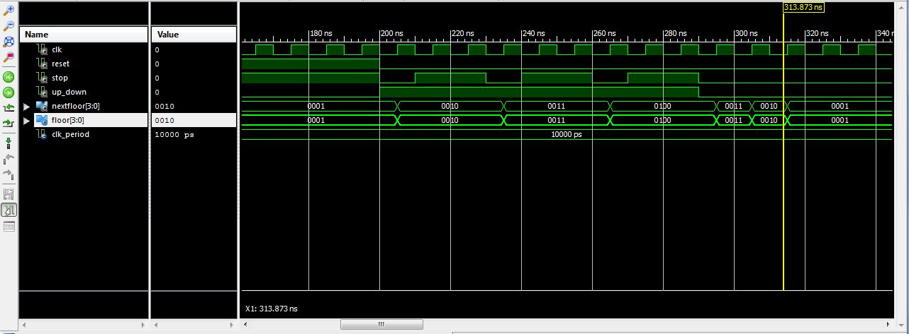

ECE281_CE3
==========

Elevator Control State Machine

## Questions

# "Is reset synchronous or asynchronous?"

No, the reset is synchronous because the if statement that implements the reset is preceded
by another if statement that detects a rising edge of the clock.

# "Will [your Mealy Machine] be different from your Moore Machine?"

Yes, but only slightly. I made the next state logic process sensitive to the reset and to stop.
This wasn't really necessary because of the way I coded my testbench, but to make it a true 
Mealy Machine it needed to be changed. I also only alowed the next state to be set when stop was. 

# "What is the clock frequency? What value would we set to simulate a 50MHz clock?"

f = 1/period. Therefore witha period of 10 ns we're operating at 100MHz. To simulate a 50MHz clock
simply solve for period which give us 20 ns or twice as long as the 100MHz clock. 

## Moore Test Results

The picture above shows the "elevator" moving from the bottom floor (0001) to the top floor (0100)
and stopping for two clock cycles each floor. On the way down it progess from the top to the bottom. 
Per the handout, this is a correct response for the test bench.

## Mealy Test Results

The picture above shows the "elevator" moving from the bottom floor (0001) to the top floor (0100)
and stopping for two clock cycles each floor. On the way down it progess from the top to the bottom. 
Per the handout, this is a correct response for the test bench.
